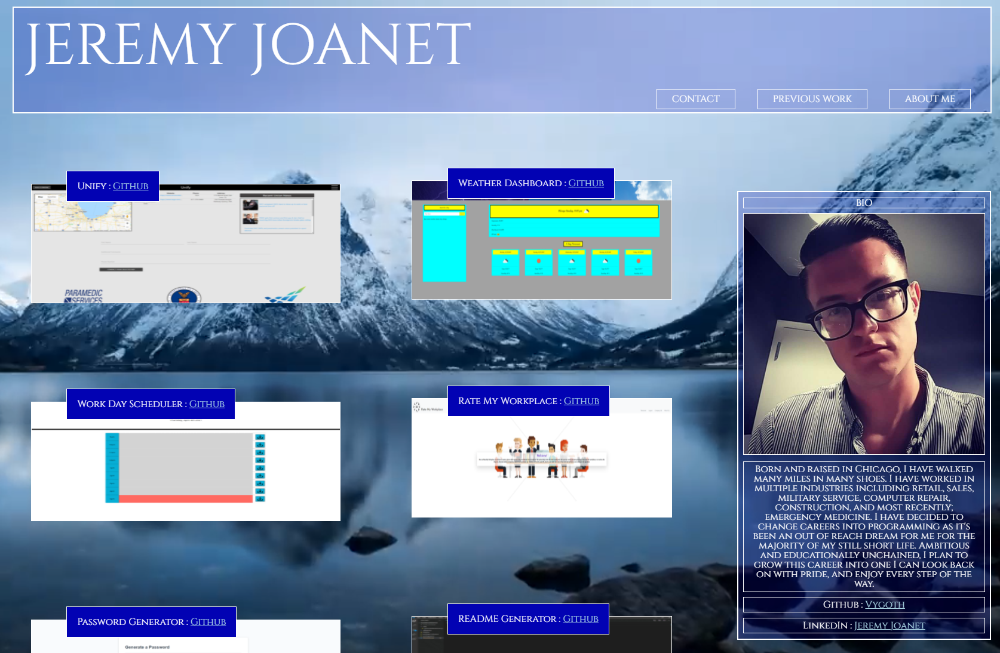

## Live Deploy
https://vygoth.github.io/Portfolio/

# First Portfolio

# Contact
Vygoth
JeremyJoanet@Protonmail.com

## Description
My first attempt at a portfolio page!
This application was concepted using Balsamiq, and I'm pretty happy with how close this came to the concepted vision.

A great learning experience to be sure, this application helped me cement my understanding on the fundamentals of HTML and CSS, since this project I've learned proper implementation of media queries, dry css usage.

Fun landing page because sometimes landing pages are fun.

## Table of Contents
- [Usage](#Usage)
- [Credits](#Credits)
- [Screenshot](#Screenshot)

## Usage
This application features a live deploy link found at the top of this README

## Credits
Videos used for background are:
home page: https://www.youtube.com/watch?v=0pmvuKzBIqM
landing page: https://www.youtube.com/watch?v=YJPgoOCOBFg
applications: https://www.vecteezy.com/video/1798489-view-of-person-typing-on-calculator-4k

## Screenshot

